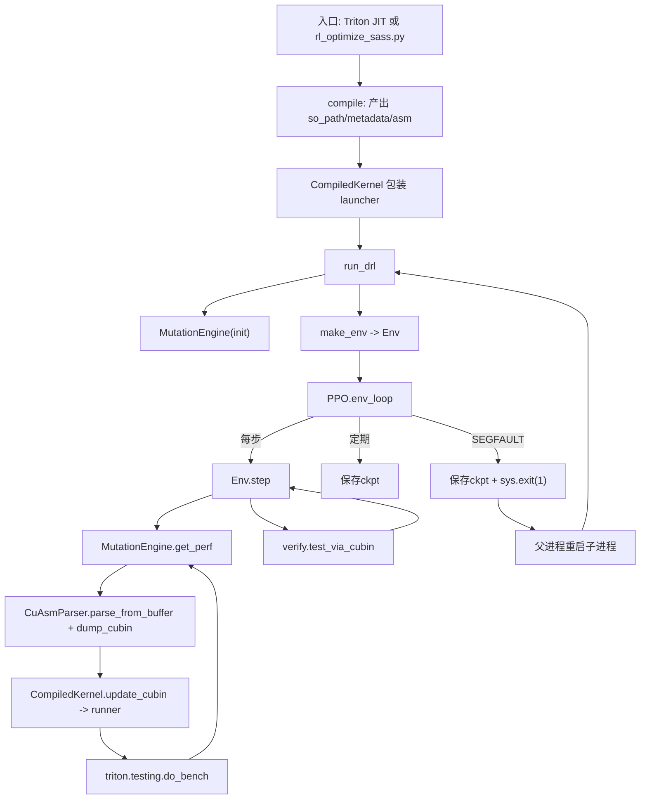
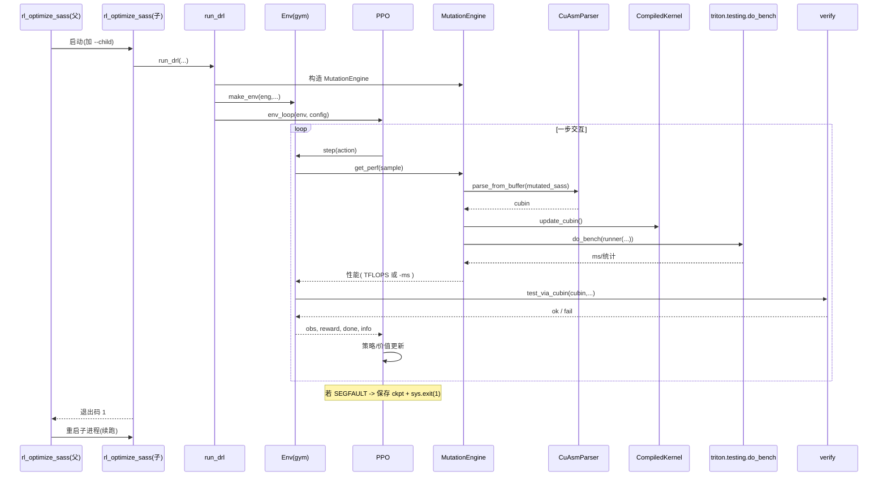

# CuAsmRL 架构与调用关系

本文总结本仓库的主要模块、关键函数与相互调用关系；并给出图形化的流程图和时序图，便于理解“训练 → 缓存 → 推理/对比”的完整闭环。

## 总览

- 入口方式（两种）
  - Triton JIT 路径：`cuasmrl/jit.py::ASMJITFunction.search()` 在编译后调用 `cuasmrl/drl.py::run_drl()` 进入训练。
  - 脚本路径：`scripts/rl_optimize_sass.py` 直接从 SASS/CUBIN 启动 RL 训练（父进程拉起子进程，子进程内执行训练并能在崩溃后续跑）。
- 训练核心
  - `cuasmrl/backend.py::MutationEngine` 负责 SASS 变异、装配（CuAssembler）、基准计时（`triton.testing.do_bench`）、性能返回。
  - `cuasmrl/ppo.py::PPO/env_loop()` 负责 PPO 训练循环，通过 Gym 环境 `cuasmrl/backend.py::Env` 与引擎交互。
  - 正确性校验：`cuasmrl/verify.py::test_via_cubin()` 在关键点做端到端比对。
- 产出
  - 训练过程会定期写入 `runs/<save_dir>/*ckpt_*.pt`，并保存最优结果（`*.pkl`、`optimized.cuasm`）。
  - 推理/对比阶段可直接加载最佳内核进行基准测试。

## 主要模块与职责

- `cuasmrl/compiler.py`
  - `compile(...)`：封装 Triton 编译流水线，返回 `so_path, metadata, asm`（包含 cubin/sass）。
  - `CompiledKernel`：封装运行期 launcher（`c_wrapper`/`runner`）、lazy 加载 cubin 句柄、TMA 参数展开等。

- `cuasmrl/jit.py`
  - `ASMJITFunction.search(...)`：若未缓存，编译 Triton kernel；随后调用 `run_drl(...)` 进入 RL 训练或 `run_selection(...)` 进行选择。

- `cuasmrl/drl.py`
  - `run_drl(...)`：创建 `MutationEngine` 与 Gym `Env`，根据配置调用 `ppo.env_loop(...)` 或 `ppo.inference(...)`。

- `cuasmrl/backend.py`
  - `Env`：Gym 环境，负责将 PPO 动作映射为 SASS 变更，通过引擎拿到性能并做正确性校验。
  - `MutationEngine`
    - `decode/ decode_ctrl_code`：解析一行 SASS 指令与控制码。
    - `get_init_perf()`：装配初始 kernel、计时返回基线性能。
    - `get_perf(sample)`：对变异后的 kernel 装配、计时，返回性能（TFLOPS 或 -ms）并可回传 cubin。
    - `assemble(sample)`：对最终 kernel 进行一次装配与计时，返回终值。
    - 内部依赖：`CuAsm.CuAsmParser`（装配）、`triton.testing.do_bench`（计时）。

- `cuasmrl/sample.py`
  - `Sample`：维护候选可变行、动作应用（交换指令）、状态嵌入与可行动作 mask 生成（基于指令依赖、barrier、stall window 等启发式）。

- `cuasmrl/ppo.py`
  - `PPO`：特征提取网络 + 策略/价值头；`CategoricalMasked` 支持带 mask 的离散动作抽样。
  - `env_loop(env, config)`：PPO 训练主循环，定期写 ckpt；遇到 `Status.SEGFAULT` 保存一次并 `sys.exit(1)` 交由外部重启。
  - `inference(env, config)`：仅加载最新 ckpt，按策略执行并输出行为与日志。

- `cuasmrl/verify.py`
  - `gen_test_samples(...)`、`e2e_test(...)`、`test_via_cubin(...)`：在训练中/结束后做端到端正确性校验。

- `scripts/rl_optimize_sass.py`
  - 父进程：负责拉起子进程（加 `--child` 标记）执行训练；若子进程以 `1` 退出（例如页故障），则重启子进程续跑，直至成功或超过重试次数。
  - 子进程：解析 SASS/CUBIN、构建 launcher stub、注入 `DRLConfig` 后调用 `run_drl(...)` 训练；训练结束扫描最优结果，输出 `optimized.cuasm`。

## 调用流程图（训练）

## 训练时序图（父子进程编排 + 一步 PPO 交互）

## 关键函数清单（按文件）

- `cuasmrl/compiler.py`
  - `compile(fn, **kwargs)` → `(so_path, metadata, asm)`
  - `class CompiledKernel`：`_init_handles()`、`assemble_tensormap_to_arg()`、`__getitem__`(runner)

- `cuasmrl/jit.py`
  - `class ASMJITFunction(JITFunction)`：`search()`（编译→调用 `run_drl`）

- `cuasmrl/drl.py`
  - `run_drl(...)`：组装 `MutationEngine`、`Env`，进入训练或推理。

- `cuasmrl/backend.py`
  - `class Env(gym.Env)`：`reset()`、`step()`
  - `class MutationEngine`：`decode()`、`decode_ctrl_code()`、`get_init_perf()`、`get_perf()`、`assemble()`、`update_cubin()`

- `cuasmrl/sample.py`
  - `class Sample`：`apply()`、`static_analysis()`、`embedding()`、`_generate_mask()`

- `cuasmrl/ppo.py`
  - `class PPO`：`get_action_and_value()`、`get_value()`
  - `env_loop()`：训练主循环（含 ckpt、SEGFAULT 处理）
  - `inference()`：加载最新 ckpt 推断

- `cuasmrl/verify.py`
  - `gen_test_samples()`、`e2e_test()`、`test_via_cubin()`

- `scripts/rl_optimize_sass.py`
  - 父进程编排、子进程训练、导出 `optimized.cuasm`

## 使用提示（与论文一致）

- 训练：对每个 kernel 先执行 RL 训练，得到优化后的内核并缓存。
- 推理/基准：完成训练后，直接加载已缓存/导出的优化内核，运行基准与其他基线（Triton、Torch）对比。
